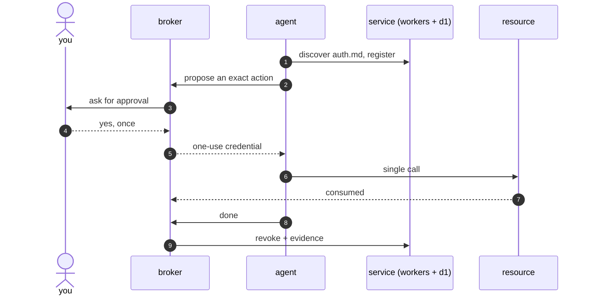

# warden.md

agent auth that ends when the work does.

an agent asks for access to your app. it gets a credential scoped to exactly what it needs. you confirm the request. when the task is done, access is revoked automatically.

the pieces for that loop exist in fragments these days. there's a protocol for agent registration, oauth plumbing for scoping, and a pile of proxies holding credentials. almost nothing ships the last step end to end: access that dies on its own.

warden.md is an open, self-hostable take on the whole loop.

## what's here

three parts, one flow:

- `check`: a cli that tells you if your service is agent ready. it validates your auth.md file, your metadata endpoints, and the exact discovery handshake an agent performs, then tells you what's missing.
- `service`: the auth.md service side, built for cloudflare workers. agents register, claim accounts, exchange scoped tokens, and get revoked, all against infrastructure you own.
- `broker`: the missing layer. completion-scoped credentials: one approval, a one-use credential, and authority that is consumed when the task ends or the clock runs out.

## the path



the credential is worth exactly one call. `done` revokes whatever is left, and the broker keeps the evidence. `check` is the outside view: it verifies your auth.md and metadata before any agent shows up.

## principles

- open protocol, open implementation. built on auth.md and the oauth standards behind it (id-jag, token exchange, resource indicators, dpop). nothing here needs a vendor account.
- self-host first. if it can't run on your own account, it isn't yours.
- fail closed. a credential you can't revoke is a liability, not a feature.
- boring where it matters. security code should be small, obvious, and tested.

## status

pre-alpha, building in public. nothing here is production ready yet. the backlog is public and written for humans to pick up, and the roadmap tracks where each piece stands.

## repo layout

```
packages/
  cli/       conformance toolkit
  service/   auth.md service side for cloudflare workers
  broker/    completion-scoped credentials
docs/        vision, architecture, roadmap
examples/    demo integrations
```

## getting involved

the whole build lives in the issue tracker. every issue is scoped, written for a human, and open. start with anything labeled `good first issue`. the three tracks (`check`, `service`, `broker`) can move in parallel, and the roadmap shows what blocks what.

## origin

this started with a question on x from [@jjacky](https://x.com/jjacky): why isn't there agent auth? ask for a login, scope it to the task, confirm it once, revoke it when the work is done. the reply that landed hardest came from [@grinich](https://x.com/grinich): this is literally auth.md.

this repo takes that seriously. auth.md is the registration protocol, and this repo is about everything that comes after it.

prior art worth reading: [workos auth.md](https://workos.com/auth-md), [schemen-gate](https://github.com/sekosai/schemen-gate), [ghostget](https://ghostget.com), [executor](https://executor.sh).

## license

[mit](./LICENSE)
