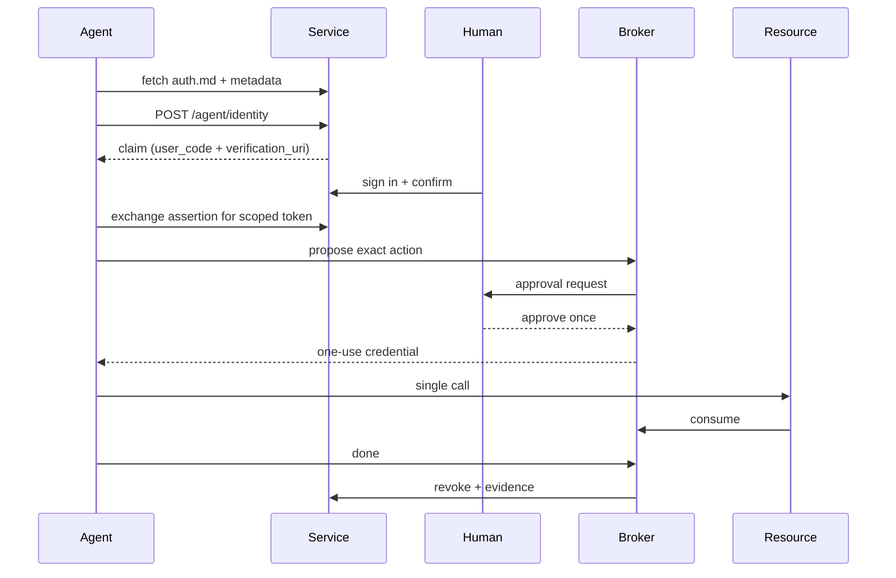

# architecture

three pieces, one loop: `check` verifies a service, `service` is the service, `broker` supervises what the service hands out.

## components

### check (packages/cli)

a cli that runs conformance checks against a hostname. it fetches the auth.md file, walks the discovery handshake, validates protected resource metadata and authorization server metadata, and reports findings with severities and ci-friendly exit codes. read-only by default; the active probe is opt-in.

### service (packages/service)

the auth.md service side as a cloudflare worker. discovery endpoints, `/agent/identity` for the three registration types, a claim ceremony for human confirmation, jose for signing and verification, a token endpoint, and revocation that speaks rfc 7009 and rfc 8935. d1 for state, durable objects for the ceremony. deploys to your account.

### broker (packages/broker)

the completion-scoped layer. an agent proposes an exact action. policy answers allow, require approval, or block. approval mints a one-use, audience-bound credential. the call consumes it. an explicit completion signal (with a ttl fallback) revokes everything and writes the evidence record.

## the full path

## design rules

- state that must be atomic lives in durable objects (claim ceremony, consume, expiry alarms). everything else lives in d1.
- no endpoint logs credentials, assertions, or proofs. errors are stable codes, not prose.
- time and identity are the only authorities: claims expire, grants expire, and a stuck job can't extend either.
- every piece must be usable alone. broker without service is valid, service without broker is valid, and check works against anything.

## stack

- typescript (strict), pnpm workspaces
- cloudflare workers, d1, durable objects
- jose for jwt signing and verification, vitest for tests
- mit license, no telemetry

## where the specs live

- auth.md and the id-jag draft define the registration and assertion formats.
- our own specs live in `docs/spec/` once the broker track starts.
